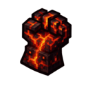

# Nether Gauntlet Mod



## Overview

The Nether Gauntlet mod adds a powerful new artifact to Minecraft - a gauntlet forged from the fires of the Nether itself!

With the Nether Gauntlet equipped, you'll gain incredible powers:
- **Punch enemies** to create devastating explosions
- **Right-click** to shoot deadly fireballs at your foes
- **Walk on lava** and surf across its surface without taking damage

## Features

- **Explosive Punches**: Hit any mob or player to create an explosion
- **Fireball Launcher**: Right-click to shoot fireballs like a Blaze
- **Lava Surfing**: Walk on lava without taking damage, and move faster across it
- **Temporary Obsidian**: Creates temporary obsidian beneath you while walking on lava
- **Fire Resistance**: Immunity to fire damage while holding the gauntlet

## Crafting Recipe

Craft the Nether Gauntlet using:
- 4 Blaze Rods
- 4 Netherite Ingots
- 1 Magma Block

Arranged in this pattern:
```
B N B
N M N
B N B
```
Where:
- B = Blaze Rod
- N = Netherite Ingot
- M = Magma Block

## Installation

1. Install Minecraft Forge for version 1.19.2
2. Download the latest release of Nether Gauntlet mod
3. Place the .jar file in your Minecraft mods folder
4. Launch Minecraft with the Forge profile

## Development Setup

See [SETUP_INSTRUCTIONS.md](SETUP_INSTRUCTIONS.md) for detailed instructions on setting up the development environment.

## License

All rights reserved.

## Credits

Created by MINDCRAFT Team using Minecraft Forge.
